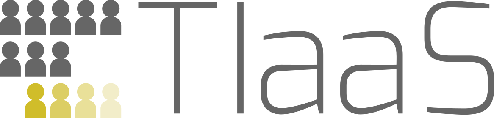

# Galaxy {#sec-galaxy .unnumbered}

The chapters in this section of the workshop will guide you through registering an account with [Galaxy EU](https://usegalaxy.eu), and uploading workshop data to the Galaxy instance.

- @sec-join-session at [https://usegalaxy.eu](https://usegalaxy.eu)
- @sec-download-data to your computer
- @sec-upload-data to your Galaxy history

## TIaaS (Teaching Infrastructure as a Service)

We are greatly indebted to the [European Galaxy TIaaS (Teaching Infrastructure as a Service)](https://usegalaxy.org/tiaas/) scheme for providing dedicated server time for your workshop today.

{fig-alt="Galaxy TIaaS (Teaching Infrastructure as a Service) logo" width="80%"}

We gratefully acknowledge the support of the Freiburg Galaxy Team: Prof. Björn Grüning and Prof. Rolf Backofen, Bioinformatics, University of Freiburg (Germany) funded by the funded by the German Federal Ministry of Education and Research BMFTR grant 031 A538A de.NBI-RBC and the Ministry of Science, Research and the Arts Baden-Württemberg (MWK) within the framework of LIBIS/de.NBI Freiburg.

You can find out more about the European Galaxy Project team [here](https://galaxyproject.org/eu/people/).
