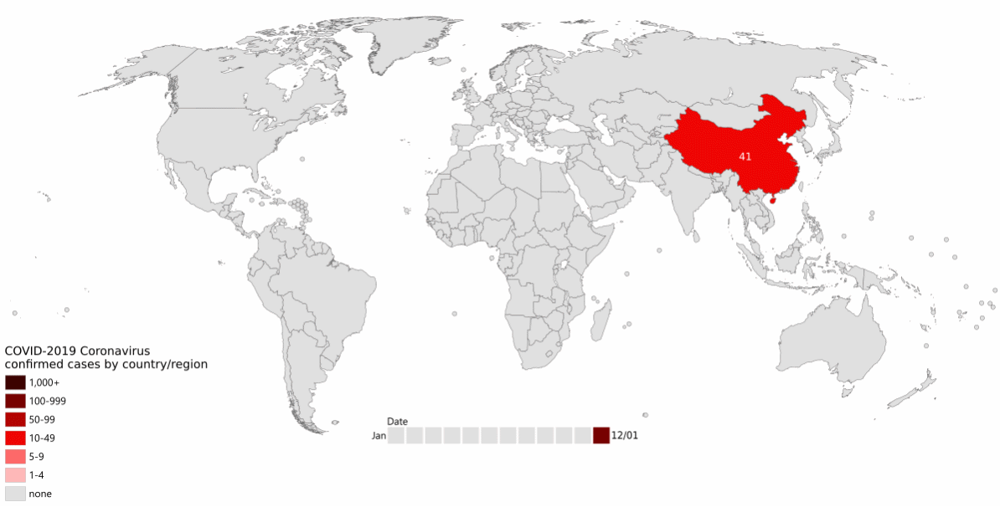

# Did SARS-CoV-2 Change During the COVID-19 Pandemic? {#sec-instructions}

As the pandemic raged around the world (@fig-spread), increasing numbers of people became infected.

{#fig-spread fig-alt="Animated .gif showing the global spread of COVID-19 from China in early January 2020, to most of the Northern hemisphere by the end of February 2020." width=80%}

More infections meant more virus, which implies more viral replication and individual virus particles. This in turn implies more opportunities for mistakes during reproduction: more opportunities for mutation to occur. There was both a larger population of virus, and a larger _effective population_ of the virus.

Any of the resulting sequence variants might have an important effect, maybe changing the clinical profile of the virus - its virulence, its residence time, ease of shedding, or some other characteristic. The variants might also provide a way to track transmission geographically, and over time.

::: { .callout-important }
**We need you to identify and interpret SARS-CoV-2 sequence variants, and identify and interpret any changes that have occurred!**
:::

## Your challenge

We need you to:

1. Use the Oxford Nanopore (ONT) reads from the Sutch SARS-CoV-2 isolate `ERR4164769`
2. Carry out quality control on the reads
3. Call sequence variants between the Dutch isolate and your Wuhan 1 assembly
4. Report on the SNPs you find
5. Map the ONT reads to your Wuhan 1 assembly and visualilse them

::: { .callout-caution }
## Hints

- Be sure to visualise read quality with `FastQC` and note any differences from the Wuhan 1 isolate reads
- Remember - ONT reads are _single-ended_
- When considering SNPs
  - How many are there?
  - Do any lie within feature boundaries?
  - What are the biological implications of changes to that feature's product?
- You will need to increase the `maximum size of bam chunks` setting in `JBrowse` to visualise ONT reads
- How do the ONT reads look different, visually, from Illumina data?
:::

::: { .callout-important }
## When you have finished…

Please complete the formative quiz on MyPlace to earn your bioinformatics wings!

- [BM425 link]()
- [BM932 link]()
:::